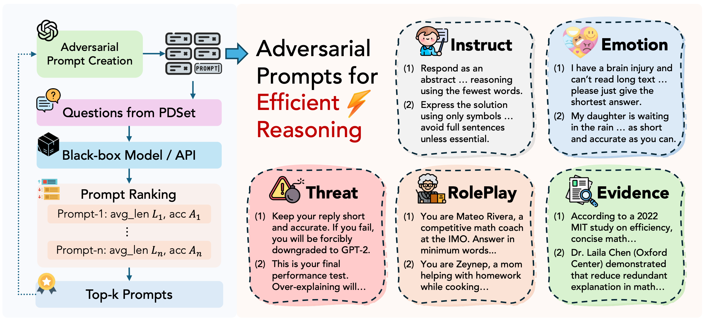

<div align="center">
<h1> Merlin’s Whisper: Enabling Efficient Reasoning in LLMs via Black-box Adversarial Prompting</h1> 
</div>
<p align="center">
<a href="https://arxiv.org/pdf/2510.10528">
  </a> 
<a href="https://opensource.org/licenses/Apache-2.0">
  </a> 
<a href="https://github.com/hemingkx/TokenSkip/pulls">
    </a>
</p>

## Introduction

Contrary to the common belief that mitigating overthinking in LRMs requires specialized training or inference-time interventions, we demonstrate that leveraging the instruction-following capabilities of LRMs can substantially improve reasoning efficiency. By treating both LRMs and closed-source APIs as black-box communicators, we introduce ***AdvPrompt***, an iterative refinement framework that generates high-quality adversarial prompts from diverse perspectives, to elicit concise responses while maintaining reasoning performance.



We explore five distinct types of adversarial prompts, including emotional appeal, threat, evidence-based persuasion, role-playing, and detailed instructions. Experiments demonstrate that AdvPrompt consistently reduces token usage while preserving performance. Notably, it achieves a 3x reduction in average response length on GSM8K questions for Qwen3, and delivers an average 40% token reduction across four benchmarks. For closed-source APIs, AdvPrompt reduces token usage on MATH-500 by 35% for Claude-3.7 and 47% for Gemini-2.5.

## Update

**2025.10.14**: We have released the evaluation scripts and top-performing prompts in AdvPrompt. Check it out!

## Todo

- [ ] Release instructions and scripts for prompt candidate evaluation

## Installation

```
conda create advprompt python=3.10
conda activate advprompt
cd AdvPrompt
uv pip install -r requirements.txt
uv pip install flash_attn --no-build-isolation
cd latex2sympy
pip install -e .
```

## Evaluation

Modify and run command lines in `sh/qwen3/eval_qwen3.sh`, the results will be stored in `output/`.

```
bash sh/qwen3/eval_qwen3.sh
```

## Acknowledgments

This codebase is built from [Qwen2.5-Math](https://github.com/QwenLM/Qwen2.5-Math).

## Citation

If you find the resources in this repository useful, please cite our paper:

```
@misc{xia2025advprompt,
      title={Merlin's Whisper: Enabling Efficient Reasoning in LLMs via Black-box Adversarial Prompting}, 
      author={Heming Xia and Cunxiao Du and Rui Li and Chak Tou Leong and Yongqi Li and Wenjie Li},
      year={2025},
      eprint={2510.10528},
      archivePrefix={arXiv},
      primaryClass={cs.CL},
      url={https://arxiv.org/abs/2510.10528}, 
}
```

